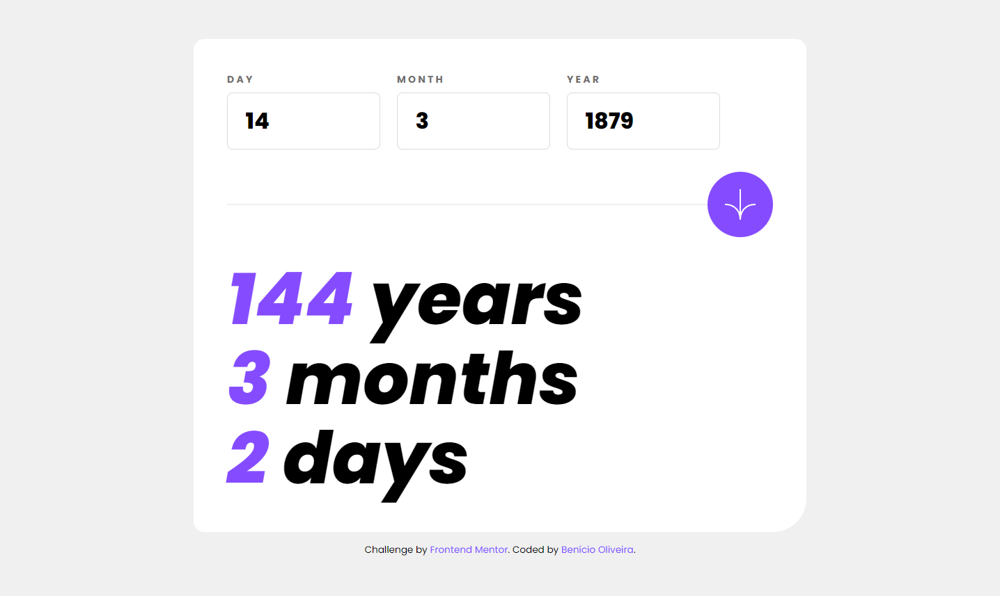

# Age calculator app [Frontend Mentor]

This is a solution to the [Age calculator app challenge on Frontend Mentor](https://www.frontendmentor.io/challenges/age-calculator-app-dF9DFFpj-Q).

## Table of contents

- [Overview](#overview)
  - [The challenge](#the-challenge)
- [My process](#my-process)
  - [Built with](#built-with)
  - [What I learned](#what-i-learned)
  - [Acknowledgement](#acknowledgement)
- [Author](#author)

## Overview

### The challenge

Users should be able to:

- View an age in years, months, and days after submitting a valid date through the form
- Receive validation errors if:
  - Any field is empty when the form is submitted
  - The day number is not between 1-31
  - The month number is not between 1-12
  - The year is in the future
  - The date is invalid e.g. 31/04/1991 (there are 30 days in April)
- View the optimal layout for the interface depending on their device's screen size
- See hover and focus states for all interactive elements on the page
- **Bonus**: See the age numbers animate to their final number when the form is submitted

## My process

### Built with

- Semantic HTML5 markup
- CSS custom properties
- Flexbox
- Desktop-first workflow
- Typescript
- [React](https://reactjs.org/) - JS library
- [Next.js](https://nextjs.org/) - React framework
- [React Hook Form](https://react-hook-form.com/) - For form validation
- [Zod](https://zod.dev/) - For form validation
- [Day.js](https://day.js.org/) - For date manipulation

### What I learned

It was my first time using _Next.js_, _React Hook Form_, _Zod_ and _Day.js_, which were the biggest challenges, besides making it responsive using media queries in CSS - something I had never done without using a framework like Tailwind CSS before.

There's still a long way to go, specially in making and validating forms, but it was pretty interesting to learn how to use _React Hook Form_ and _Zod_, definitely a better way to work with forms.

### Acknowledgement

People and resources that helped me get through the challenge.

- [Kevin Powell](https://www.youtube.com/@KevinPowell) - CSS
- [Web Dev Simplified](https://www.youtube.com/@WebDevSimplified) - React/Zod
- [Rocketseat](https://www.youtube.com/@rocketseat) - Zod
- [Stackoverflow @nickf](https://stackoverflow.com/a/1433119) - Check date validity
- [Stackoverflow @jfriend00](https://stackoverflow.com/a/16994725) - Animate numbers

## Author

- [@benilio](https://www.frontendmentor.io/profile/benilio) - Frontend Mentor
- [Website](https://benilio.vercel.app/)
- [LinkedIn Profile](https://br.linkedin.com/in/ben%C3%ADcio-oliveira-458158135)
